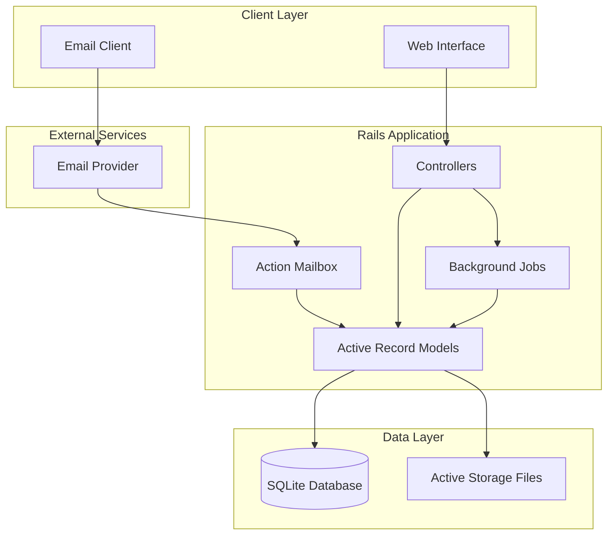

# Design Document

## Overview

Idea Foundry is a single-user Rails 8.1 application that provides a comprehensive platform for idea management and development tracking. The system leverages modern Rails features including Hotwire for reactive UI, Solid Queue for background processing, and Active Storage for file management.

The architecture follows Rails conventions with a focus on progressive enhancement through Turbo and Stimulus. The application uses a single SQLite database for simplicity while maintaining the flexibility to scale to PostgreSQL if needed.

## Architecture

### High-Level Architecture



### Technology Stack

- **Framework**: Ruby on Rails 8.1
- **Database**: SQLite (with migration path to PostgreSQL)
- **Frontend**: Hotwire (Turbo + Stimulus) with minimal JavaScript
- **Background Jobs**: Solid Queue
- **Caching**: Solid Cache
- **File Storage**: Active Storage with local disk storage
- **Email Processing**: Action Mailbox
- **Rich Text**: Action Text with Trix editor
- **Authentication**: Rails built-in session management
- **Asset Pipeline**: Propshaft with importmap

## Components and Interfaces

### Core Models

#### User Model

```ruby
class User < ApplicationRecord
  has_many :lists, dependent: :destroy
  has_many :ideas, through: :lists
  has_many :templates, dependent: :destroy
  has_many :export_jobs, dependent: :destroy

  # Single-user application - one user per instance
  validates :email, presence: true, uniqueness: true
end
```

#### Idea Model

```ruby
class Idea < ApplicationRecord
  belongs_to :user
  has_many :idea_lists, dependent: :destroy
  has_many :lists, through: :idea_lists
  has_many :versions, dependent: :destroy
  has_many :notes, dependent: :destroy
  has_many_attached :attachments
  has_rich_text :description

  # Lifecycle management
  enum state: {
    new: 0, triage: 1, first_try: 2, second_try: 3,
    incubating: 4, validated: 5, parked: 6, rejected: 7, shipped: 8
  }

  # Scoring attributes
  validates :trl, :difficulty, :opportunity, :timing,
            inclusion: { in: 0..10 }
end
```

#### Version Model

```ruby
class Version < ApplicationRecord
  belongs_to :idea
  belongs_to :parent_version, class_name: 'Version', optional: true
  has_many :child_versions, class_name: 'Version',
           foreign_key: 'parent_version_id'

  # Snapshot storage
  serialize :snapshot_data, JSON

  # Version metadata
  validates :commit_message, presence: true
end
```

#### List Model

```ruby
class List < ApplicationRecord
  belongs_to :user
  has_many :idea_lists, -> { order(:position) }, dependent: :destroy
  has_many :ideas, through: :idea_lists

  validates :name, presence: true
  validates :position, presence: true, uniqueness: { scope: :user_id }
end
```

### Controllers Architecture

#### Ideas Controller

- Handles CRUD operations for ideas
- Manages state transitions with validation
- Provides filtering and sorting capabilities
- Integrates with versioning system

#### Lists Controller

- Manages list creation and organization
- Handles drag-and-drop reordering via Turbo
- Provides cluster view toggle functionality

#### Versions Controller

- Manages version creation and restoration
- Provides diff visualization
- Handles branching and merging operations

#### Clusters Controller

- Manages spatial positioning of ideas
- Handles canvas operations (zoom, pan)
- Persists cluster definitions and card coordinates

### Background Jobs

#### Version Creation Job

```ruby
class CreateVersionJob < ApplicationJob
  def perform(idea, commit_message, user)
    # Create snapshot of current idea state
    # Generate diff from previous version
    # Update version tree structure
  end
end
```

#### Export Workspace Job

```ruby
class ExportWorkspaceJob < ApplicationJob
  def perform(user, options = {})
    # Package database content
    # Include all attached files
    # Generate manifest and documentation
    # Create encrypted archive if requested
  end
end
```

#### Cool-off Transition Job

```ruby
class CoolOffTransitionJob < ApplicationJob
  def perform(idea)
    # Check if cool-off period has expired
    # Transition idea back to editable state
    # Send notification if configured
  end
end
```

### Email Integration

#### Ideas Mailbox

```ruby
class IdeasMailbox < ApplicationMailbox
  before_processing :authenticate_sender

  def process
    # Parse subject for existing idea reference
    # Extract category tags
    # Create or update idea
    # Handle attachments
  end

  private

  def authenticate_sender
    # Validate sender against whitelist
  end
end
```

## Data Models

### Database Schema

#### Core Tables

**users**

- id (primary key)
- email (unique)
- name
- settings (JSON)
- created_at, updated_at

**ideas**

- id (primary key)
- user_id (foreign key)
- title
- state (enum)
- category
- trl, difficulty, opportunity, timing (integers 0-10)
- computed_score (decimal)
- attempt_count (integer)
- cool_off_until (datetime)
- cluster_x, cluster_y (decimal, nullable)
- created_at, updated_at

**lists**

- id (primary key)
- user_id (foreign key)
- name
- position (integer)
- created_at, updated_at

**idea_lists** (join table)

- id (primary key)
- idea_id (foreign key)
- list_id (foreign key)
- position (integer)

**versions**

- id (primary key)
- idea_id (foreign key)
- parent_version_id (foreign key, nullable)
- commit_message
- snapshot_data (JSON)
- diff_summary (text)
- created_at

**templates**

- id (primary key)
- user_id (foreign key)
- name
- is_default (boolean)
- field_definitions (JSON)
- section_order (JSON)

### Relationships and Constraints

- Users have many lists and ideas (through lists)
- Ideas can belong to multiple lists (many-to-many)
- Ideas have many versions in a tree structure
- Versions store complete snapshots for reliable restoration
- Templates define custom metadata fields and UI layout

## Error Handling

### Application-Level Error Handling

#### Validation Errors

- Use Rails built-in validation with custom error messages
- Display errors inline with Turbo Stream updates
- Provide contextual help for complex validations

#### Background Job Failures

- Implement retry logic with exponential backoff
- Log failures with detailed context
- Provide user notifications for critical failures

#### File Upload Errors

- Validate file types and sizes before upload
- Handle storage failures gracefully
- Provide progress feedback for large uploads

### Email Processing Errors

- Bounce invalid emails with helpful messages
- Log unauthorized access attempts
- Handle malformed email content safely

### Data Integrity

- Use database constraints for critical relationships
- Implement soft deletes for user data
- Maintain audit trails for important operations

## Testing Strategy

### Unit Testing

- Model validations and business logic
- Service object functionality
- Background job behavior
- Email processing logic

### Integration Testing

- Controller actions and responses
- Email ingestion workflows
- File upload and processing
- Authentication and authorization

### System Testing

- End-to-end user workflows
- JavaScript interactions with Stimulus
- Turbo Stream updates and navigation
- Mobile responsiveness

### Performance Testing

- Database query optimization
- Large dataset handling
- File upload performance
- Export generation timing

## Frontend Architecture

### Hotwire Integration

#### Turbo Drive

- Provides SPA-like navigation without JavaScript frameworks
- Handles form submissions with automatic error handling
- Manages browser history and caching

#### Turbo Frames

- Isolates page sections for independent updates
- Used for idea cards, lists, and detail panels
- Enables lazy loading of expensive content

#### Turbo Streams

- Real-time updates for drag-and-drop operations
- Live progress updates for export jobs
- Dynamic filtering and sorting results

#### Stimulus Controllers

- **Drag Controller**: Handles drag-and-drop for lists and clusters
- **Cluster Controller**: Manages canvas interactions (zoom, pan, select)
- **Score Controller**: Updates computed scores in real-time
- **Filter Controller**: Manages client-side filtering
- **Modal Controller**: Handles modal dialogs and overlays

### Progressive Enhancement

- Core functionality works without JavaScript
- Enhanced interactions layer on top with Stimulus
- Graceful degradation for accessibility

## Security Considerations

### Authentication

- Session-based authentication for single-user application
- Optional environment-based authentication for development
- Secure session configuration with proper timeouts

### Data Protection

- Active Record encryption for sensitive metadata
- Secure file upload validation and storage
- SQL injection prevention through parameterized queries

### Email Security

- Sender whitelist validation
- Content sanitization for rich text
- Attachment scanning and validation

### Export Security

- Optional password protection for exports
- Secure temporary file handling
- Cleanup of sensitive data after export

## Performance Optimization

### Database Optimization

- Proper indexing for common queries
- Eager loading to prevent N+1 queries
- Connection pooling for concurrent requests

### Caching Strategy

- Fragment caching for expensive renders
- Query result caching with Solid Cache
- HTTP caching headers for static assets

### File Handling

- Streaming uploads for large files
- Background processing for file operations
- Efficient thumbnail generation

### Frontend Performance

- Minimal JavaScript bundle size
- Lazy loading of non-critical content
- Optimized asset delivery with Propshaft
